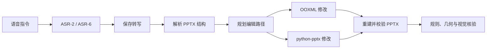

# Voice-2-PPT Agent：语音驱动的 PowerPoint 编辑与可靠性评估

[English](README_EN.md) | 中文

Voice-to-PPT Agent 是一个面向真实 PowerPoint 编辑任务的研究项目。它将自动语音识别（ASR）接入 PPTArena/PPTPilot 的幻灯片编辑流程，并通过规则、几何和视觉检查判断输出是否真正满足指令，而不只检查是否生成了 PPTX 文件。

项目从论文代码复现开始，依次完成了本地环境适配、GUI 验证、CLI 重构、双 ASR 接入、DeepSeek 兼容接口适配和两阶段实验。`run.py` 是最终端到端流程的主要入口。

完整的方法、结果与失败分析见中英文实验报告：

- [中文实验报告](reports/voice_to_ppt_experiment_report_zh.pdf)
- [English Experimental Report](reports/voice_to_ppt_experiment_report_en.pdf)

## 项目贡献

- 修复 PPTArena/PPTPilot 在路径、依赖、模型配置、API 调用和输出目录方面的本地环境耦合；
- 复现原始 GUI 工作流，并将核心编辑链路重构为支持单条和批量实验的 CLI；
- 接入 faster-whisper large-v3-turbo 与 Qwen3-ASR-1.7B，单独保存转写以区分 ASR 错误与 Agent 错误；
- 适配 DeepSeek 兼容端点，将规划与编辑模型切换到更适合批量实验的配置；
- 建立“文件可读—编辑信号—确定性规则—几何与视觉核验”的分层评价方法；
- 整理 10 个 PPTArena 探索案例，以及 128 次首轮实验和 48 次定向二轮实验的结构化证据。

## 系统流程



幻灯片解析、规划和编辑框架改编自 PPTArena/PPTPilot。本项目在此基础上完成本地适配、CLI、ASR 接入、模型接口、过程留痕、实验执行和结果评价。第三方来源与项目归属见 [NOTICE.md](NOTICE.md)。

## 实验设计与结果

### 第一阶段：PPTArena GUI/CLI 探索

第一阶段从 **PPTArena 数据集**中选取 10 个任务案例，使用本地复现的 GUI 和重构后的 CLI 进行探索性测试，其中 GUI 4 个、CLI 6 个。不同案例采用的任务、模型和编辑轮数并不完全相同，因此这些结果用于发现工程问题和典型失败，不作为严格配对的 GUI/CLI 性能基准。

案例级输入、配置和双评价文本见 [第一阶段结果表](results/stage1_pptarena_exploration.csv)。

### 第二阶段：ASR + Agent

首轮实验使用 4 个任务、每个任务 16 种口语/声学组合和 2 种 ASR：

```text
4 个任务 × 16 种语音条件 × 2 个 ASR = 128 次首轮运行
```

随后对 `id20 / ASR-2`、`id31 / ASR-2` 和 `id31 / ASR-6` 各进行 16 次定向二轮实验，共增加 48 次。逐次结果表因此包含 176 条唯一运行记录。

| 首轮指标 | ASR-2 | ASR-6 |
|---|---:|---:|
| 生成且可读取最终 PPTX | 61/64 | 63/64 |
| 输出且有编辑信号 | 52/64 | 60/64 |
| 三项确定性规则正确 | 32/48 | 38/48 |
| `id31` 图片布局正确 | 10/16 | 10/16 |
| 综合任务核验正确 | 42/64 | 48/64 |

在 48 条匹配的定向二轮样本中，正确结果由首轮的 22/48 变为 20/48。第二轮能够修复部分失败，也可能覆盖已经正确的结果。`id31` 在两种 ASR、两个轮次下共有 64 个布局结果，其中 37 个通过；最常见的失败是多张图片被移动到同一中心位置后发生重叠。

实验表明，转写质量会影响关键数值和单位的保留，但高质量转写、编辑日志或可读取的 PPTX 都不能单独证明任务完成。对象定位、空间规划、生成代码的可靠性和输出验证同样重要。

## 安装与配置

项目要求 Python 3.10 或更高版本。按需要安装相应的 ASR 依赖：

```bash
python -m pip install -e ".[whisper]"
# 或
python -m pip install -e ".[qwen]"
```

将 `.env.example` 复制为 `.env`，再填写 API Key、服务端点以及规划和编辑模型名称。实验中使用的模型名称是当时服务端点提供的别名。

## 运行端到端流程

处理单条音频：

```bash
python run.py \
  --audio path/to/instruction.wav \
  --pptx path/to/slides.pptx \
  --asr faster-whisper
```

批量处理一个音频目录：

```bash
python run.py \
  --audio-dir path/to/audio_folder \
  --pptx path/to/slides.pptx \
  --asr qwen-asr \
  --rounds 2 \
  --reuse-transcripts
```

默认使用 OOXML 编辑路径。要复现实验中的混合路由，需要明确允许执行模型生成的 Python：

```bash
python run.py \
  --audio path/to/instruction.wav \
  --pptx path/to/slides.pptx \
  --execution-mode auto \
  --allow-generated-code
```

生成的 Python 代码会以当前用户权限运行，并不处于安全沙箱中。请只在隔离环境中处理可信输入。

安装项目后，还可以使用 `voice-ppt` 执行文本编辑、PPTX 结构检查、实验计划展开和结果验证；这些命令是 `run.py` 主流程的辅助工具。

## 复核实验材料

| 位置 | 内容 |
|---|---|
| [reports/](reports/) | 中英文实验报告、LaTeX 源文件和报告图片 |
| [experiments/](experiments/) | 两个阶段的机器可读实验设计 |
| [results/](results/) | 10 个 PPTArena 探索案例、176 条逐次记录及汇总结果 |
| [tests/](tests/) | CLI、PPTX 处理和实验数据一致性测试 |

无需下载 ASR 模型或调用 API，即可核对已保存的实验材料：

```bash
python -m pip install -e ".[dev]"
voice-ppt plan-experiment
voice-ppt validate-results
python -m pytest
```

其中 `validate-results` 只检查实验设计与已保存结果是否一致，不会重新运行 176 次实验。

## 仓库结构

```text
run.py                         主要入口：语音 + PPTX → 转写 + 编辑结果
src/voice_ppt_agent/           ASR、LLM、PPTX 编辑和命令行实现
experiments/                   机器可读实验设计
results/                       逐次结果和汇总统计
reports/                       中英文报告及可编译 LaTeX 源文件
tests/                         离线回归与结果一致性检查
```

本项目的实验结论来自 4 类任务、2 种 ASR 和 1 个 PPT 编辑 Agent，适用于解释本仓库记录的实验范围，不代表完整 TSBench 分布或生产级 PowerPoint 自动化能力。
