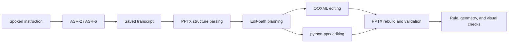

# Voice-2-PPT Agent: Speech-Driven PowerPoint Editing and Reliability Evaluation

English | [中文](README.md)

Voice-to-PPT Agent is a research project for editing real PowerPoint files from spoken instructions. It connects automatic speech recognition (ASR) to the PPTArena/PPTPilot editing pipeline and evaluates whether the final presentation satisfies the instruction, rather than treating PPTX generation alone as success.

The project progressed from paper-code reproduction to local environment fixes, GUI validation, CLI refactoring, dual-ASR integration, DeepSeek-compatible API support, and two stages of experimentation. `run.py` is the main entry point for the final end-to-end pipeline.

Full methods, results, and failure analyses are available in both languages:

- [Chinese experimental report](reports/voice_to_ppt_experiment_report_zh.pdf)
- [English experimental report](reports/voice_to_ppt_experiment_report_en.pdf)

## Contributions

- Removed local-environment assumptions in PPTArena/PPTPilot, including fixed paths, dependency settings, model configuration, API calls, and output directories;
- reproduced the original GUI workflow and refactored the core editing pipeline into a CLI suitable for individual and batch experiments;
- integrated faster-whisper large-v3-turbo and Qwen3-ASR-1.7B, preserving transcripts separately to distinguish ASR errors from agent errors;
- adapted the planning and editing calls to a DeepSeek-compatible endpoint for lower-cost batch experiments;
- introduced a layered evaluation scheme covering file readability, edit signals, deterministic rules, geometry, and visual inspection;
- organized evidence for 10 PPTArena exploratory cases, 128 first-round runs, and 48 targeted second-round runs.

## Pipeline



The presentation parsing, planning, and editing framework is adapted from PPTArena/PPTPilot. This project adds local adaptation, the CLI, ASR integration, model-endpoint support, execution records, experiment tooling, and result evaluation. See [NOTICE_EN.md](NOTICE_EN.md) for provenance and attribution.

## Experiments and Results

### Stage 1: PPTArena GUI/CLI Exploration

The first stage selected **10 tasks from the PPTArena dataset** for exploratory testing with the reproduced GUI and the refactored CLI: four GUI cases and six CLI cases. Because the tasks, models, and editing-pass counts were not identical across cases, this stage is presented as engineering exploration and failure discovery, not as a controlled or paired GUI-versus-CLI benchmark.

Case-level prompts, configurations, and evaluations from two judges are preserved in the [Stage 1 result table](results/stage1_pptarena_exploration.csv).

### Stage 2: ASR + Agent

The first round combined four tasks, 16 spoken/acoustic conditions per task, and two ASR systems:

```text
4 tasks × 16 speech conditions × 2 ASR systems = 128 first-round runs
```

Three targeted second-round groups were then evaluated: `id20 / ASR-2`, `id31 / ASR-2`, and `id31 / ASR-6`, with 16 runs in each group. The run-level table therefore contains 176 unique records.

| First-round metric | ASR-2 | ASR-6 |
|---|---:|---:|
| Final PPTX produced and readable | 61/64 | 63/64 |
| Output produced with an edit signal | 52/64 | 60/64 |
| Correct on three deterministic rules | 32/48 | 38/48 |
| Correct `id31` image layout | 10/16 | 10/16 |
| Correct under task-level verification | 42/64 | 48/64 |

Across the 48 matched targeted cases, the number of correct results changed from 22/48 after the first pass to 20/48 after the second. A second pass repaired some failures but also overwrote some already-correct outputs. Among the 64 `id31` layouts spanning two ASR systems and two rounds, 37 passed; the most common failure placed multiple images at the same center position and caused overlap.

The results show that transcription quality affects the preservation of critical numbers and units, but a good transcript, an edit log, or a readable PPTX is not sufficient evidence of task completion. Object selection, spatial planning, generated-code reliability, and output verification remain equally important.

## Installation and Configuration

Python 3.10 or later is required. Install the optional dependency set for the ASR backend you want to use:

```bash
python -m pip install -e ".[whisper]"
# or
python -m pip install -e ".[qwen]"
```

Copy `.env.example` to `.env`, then provide the API key, endpoint, planning model, and editing model. The model names recorded in this project are aliases exposed by the experimental endpoint at the time of the runs.

## Run the End-to-End Pipeline

Process one audio file:

```bash
python run.py \
  --audio path/to/instruction.wav \
  --pptx path/to/slides.pptx \
  --asr faster-whisper
```

Process a directory of audio files:

```bash
python run.py \
  --audio-dir path/to/audio_folder \
  --pptx path/to/slides.pptx \
  --asr qwen-asr \
  --rounds 2 \
  --reuse-transcripts
```

OOXML editing is the default. Reproducing the experimental hybrid route requires an explicit opt-in for model-generated Python:

```bash
python run.py \
  --audio path/to/instruction.wav \
  --pptx path/to/slides.pptx \
  --execution-mode auto \
  --allow-generated-code
```

Generated Python runs with the current user's permissions and is not sandboxed. Use this option only with trusted inputs in an isolated environment.

After installation, `voice-ppt` also provides text editing, PPTX inspection, experiment-plan expansion, and result validation. These commands support the main `run.py` workflow.

## Review the Evidence

| Location | Contents |
|---|---|
| [reports/](reports/) | Chinese and English reports, LaTeX sources, and report figures |
| [experiments/](experiments/) | Machine-readable designs for both experimental stages |
| [results/](results/) | 10 PPTArena exploratory cases, 176 run-level records, and aggregate results |
| [tests/](tests/) | CLI, PPTX processing, and experiment-data consistency checks |

The retained evidence can be checked without downloading ASR models or calling an API:

```bash
python -m pip install -e ".[dev]"
voice-ppt plan-experiment
voice-ppt validate-results
python -m pytest
```

`validate-results` checks the consistency of the experiment design and saved result tables. It does not rerun the 176 experiments.

## Repository Layout

```text
run.py                         Main entry point: audio + PPTX → transcript + edited output
src/voice_ppt_agent/           ASR, LLM, PPTX editing, and CLI implementation
experiments/                   Machine-readable experiment designs
results/                       Run-level evidence and aggregate statistics
reports/                       Bilingual reports and compilable LaTeX sources
tests/                         Offline regression and data-consistency checks
```

The reported findings cover four task types, two ASR systems, and one PowerPoint editing agent. They describe the experiments retained in this repository and should not be generalized to the full TSBench distribution or production-grade PowerPoint automation.
